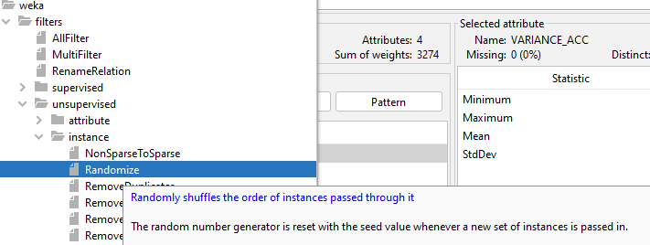

= Fitness Tracker Applikation
:authors:Jan Krüger <jankrueger1999@gmail.com>; Dominik Zimaj <dominik.zimaj@hotmail.de>
:toc:
:toc-title: Inhaltsverzeichnis

== Einleitung

Dieses Dokument dient als Abschlussbericht über das dritte Praktikum im Modul 'context aware and mobile computing'.
Es werden visionären Inhalte und Konzepte dargestellt, der Machine-Learning Workflow erläutert und auf die Implementation in einer eigenen Applikation eingegangen.

Ziel des dritten Praktikums ist es, einen Fitness-Tracker zu implementieren, der zunächst die drei Aktivitäten "Gehen", "Rennen" und "Fahrrad fahren" erkennen kann.
Die Erkennung wird durch ein "Machine-Learning" Workflow realisiert.
Weitere Aspekte der Applikation in Bezug zu Kontextarten oder Funktionalitäten werden im Folgenden weiter vertieft.

== Konzepte der Applikation

Im ersten Schritt gilt es zu definieren, inwiefern die verschiedenen Kontextarten in der Applikation zum Einsatz kommen.

=== Kontextarten in der Applikation

* Physikalischer Kontext
** Accelerometer in m/s²
** Gyroskop in m/s²
** Geschwindigkeit in m/s

Der physikalische Kontext wird durch die genannten physikalischen Sensordaten abgebildet.

* Digitaler Kontext
** Wetter (Wetterdienst-API)

Der digitale Kontext kommt durch den Abruf einer Wetterdienst-API vor, durch diese beispielsweise eine Push-Benachrichtigung gesendet werden könnte, wenn das derzeitige Wetter sonnig oder trocken ist um den User zu Aktivitäten zu animieren.

* Konzeptioneller Kontext mit Machine-Learning
** Sportarterkennung
*** Laufen
*** Gehen
*** Fahrrad fahren

Der konzeptionelle Kontext wird durch die Erkennung der Sportart abgedeckt.
Für die Erkennung wird ein Entscheidungsbaum erstellt, der sich leicht in die Applikation integrieren lässt, um die derzeitige Aktivität anzeigen zu können.

=== Machine-Learning Workflow

Grundlage eines Entscheidungsbaums ist ein Machine-Learning Workflow, welcher in folgende Abschnitte eingeteilt werden kann:

. Datensammlung
. Preprocessing
. Feature Engineering
. Training
. Evaluation

Auf die genaue Implementation des Workflows wird im Folgenden näher eingegangen.

== Datensammlung

Der wichtigste Aspekt bei der Erstellung eines "Classifiers" für Machine-Learning Anwendungen ist die Datenbasis, anhand dessen gelernt wird.
Diese Datenbasis trägt maßgeblich dazu bei, wie gut der Klassifizierer die Aktivitäten trotz unterschiedlicher Bewegmuster erkennen kann.
Idealerweise werden möglichst viele Daten gesammelt von unterschiedlichen Personen, die das Aufnahmegerät an unterschiedlichen Stellen am Körper getragen haben.

Die Datensammlung in diesem Praktikum wurde durch die bereits gezeigten Datensammler-App aus Praktikum 1 durchgeführt.
Der Datensammler tastet mit einem Intervall von ca. 45 Mal pro Sekunde die Sensorwerte für Accelerometer, Gyroskop (auf jeweils allen drei Achsen) und zusätzlich die Geschwindigkeit in m/s ab.

So wurden die Daten für die "Gehen", "Rennen" und "Fahrrad fahren" Aktivitäten in getrennten Abläufen gesammelt, um die Daten im Nachgang korrekt manuell klassifizieren und als Testdaten nutzen zu können.

Auszug aus den gesammelten Daten für die Klasse "Fahrrad fahren":

[source,text]
----
ACC_X,ACC_Y,ACC_Z,GYRO_X,GYRO_Y,GYRO_Z,TIMESTAMP,SPEED
-8.322245,5.659893,2.2409728,0.019547688,0.0061086523,-0.0061086523,1692559502142,1.3436041
-7.5465236,7.441179,2.825158,0.015882496,0.009773844,-0.0061086523,1692559502341,1.3436041
-7.642292,4.1371803,2.2888567,0.009773844,0.009773844,-0.004886922,1692559502542,1.3436041
-9.14585,3.4859576,4.501099,0.004886922,0.010995574,-0.0061086523,1692559502742,1.3436041
-1.5035586,-0.5363012,-4.357447,0.002443461,0.014660766,-0.008552114,1692559502942,1.3436041
...
----

== Verarbeitung der Daten

Der nächste Schritt im Machine-Learning Workflow bevor anhand der Daten die Feature-Erkennung stattfinden kann, ist die (Vor-)Verarbeitung der Daten um sie beispielsweise zu normalisieren, ein Noise-Filtering anzuwenden oder outlier zu entfernen, die den Lernerfolg (negativ) beeinflussen könnten.

Konkret wurden für die "Magnitude" der Accelerometer und Gyroskop Daten aus allen Achsen berechnet, da es weniger relevant ist, auf genaue welcher Achse die Bewegung stattgefunden hat, sondern wie hoch war der Ausschlag der jeweiligen Sensoren.
Dies macht die Kategorisierung der Daten einfacher.

== Feature Engineering

Damit Ausreißer weniger stark ins Gewicht fallen wird außerdem nach der Berechnung der Magnitude des Accelerometers und Gyroskops und der reinen Geschwindigkeit in m/s ein "Windowing" Verfahren eingesetzt, um aus den jeweiligen Fenstern die statistische Varianz zu bestimmen.
Die genaue Fenstergröße für den Machine-Learner wurde auf ca. eine Sekunde (hier also jeweils 45 Samples) gewählt.

Resultat der Verarbeitung der reinen Sensordaten:

[source,text]
----
VARIANCE_ACC,VARIANCE_GYRO,SPEED,TYPE
10.195760368222567,0.02113275938629518,1.3436041,BIKING
28.137497392452435,0.07377202066891454,1.4844276,RUNNING
10.195760368222567,0.02113275938629518,1.3436041,BIKING
19.901854073749504,0.09575124692883207,1.4844276,RUNNING
3.3097732017373787,0.13609539611703214,1.4041605,WALKING
4.9444779836404065,0.1469592684536334,1.4041605,WALKING
10.890553678616552,0.14445519000334742,1.4041605,WALKING
...
----

== J48 Entscheidungsbaum in WEKA

Für die Erstellung eines Entscheidungsbaums wurde das Tool WEKA ausgewählt.
Dieses erlaubt es uns die Daten, welche im CSV Format vorliegen nicht nur zu importieren, sondern auch auf den Daten weitere Filterungen oder Verarbeitungen vorzunehmen.
Hier wurde der *Randomize* Filter auf die CSV Daten angewendet, welcher die Daten in einer zufälligen Reihenfolge in den Lern-Algorithmus gibt.
Zwar gehören zu den Daten keine Zeitreiheninformationen wie z.B. der Timestamp mehr an dieser Stelle, dennoch ist es theoretisch profitabel ein "shuffeln" der Daten vorzunehmen um keine Abhängigkeiten der Daten feststellen zu können.

Das "shuffeln" bietet außerdem einen zweiten Vorteil.
Dadurch dass die Daten nicht nach den Klassen sortiert sind, können wir auf eine separate Testdatei mit *getrennten* Daten zunächst testweise verzichten für die Evaluation des Modells.
Als Testdaten werden wir ca. ein Drittel der Lerndaten verwenden mit WEKAs Option die Daten in Lern- und Testdaten zu splitten.

== Evaluation der Modelle

Entscheidungsbaum mit dem Speed Classifier:

[source.text]
----
=== Classifier model ===

J48 pruned tree
------------------

SPEED <= 1.831048
|   SPEED <= 1.384318
|   |   VARIANCE_GYRO <= 0.026769
|   |   |   SPEED <= 1.273679: WALKING (169.0/15.0)
|   |   |   SPEED > 1.273679
|   |   |   |   VARIANCE_ACC <= 10.981694: BIKING (33.0/6.0)
|   |   |   |   VARIANCE_ACC > 10.981694: WALKING (21.0/8.0)
|   |   VARIANCE_GYRO > 0.026769
|   |   |   SPEED <= 0
|   |   |   |   VARIANCE_GYRO <= 0.120778: WALKING (43.0/9.0)
|   |   |   |   VARIANCE_GYRO > 0.120778: BIKING (21.0/12.0)
|   |   |   SPEED > 0
|   |   |   |   VARIANCE_ACC <= 18.754174
|   |   |   |   |   VARIANCE_GYRO <= 0.12611
|   |   |   |   |   |   SPEED <= 1.101376
|   |   |   |   |   |   |   SPEED <= 1.079156: WALKING (249.0/50.0)
|   |   |   |   |   |   |   SPEED > 1.079156: RUNNING (26.0/3.0)
|   |   |   |   |   |   SPEED > 1.101376: WALKING (357.0/116.0)
|   |   |   |   |   VARIANCE_GYRO > 0.12611: WALKING (202.0/60.0)
|   |   |   |   VARIANCE_ACC > 18.754174: RUNNING (192.0/77.0)
|   SPEED > 1.384318
|   |   VARIANCE_GYRO <= 0.046129
|   |   |   VARIANCE_ACC <= 13.365635
|   |   |   |   VARIANCE_ACC <= 7.366421: RUNNING (37.0/7.0)
|   |   |   |   VARIANCE_ACC > 7.366421
|   |   |   |   |   VARIANCE_GYRO <= 0.016432: BIKING (49.0/4.0)
|   |   |   |   |   VARIANCE_GYRO > 0.016432
|   |   |   |   |   |   SPEED <= 1.753143
|   |   |   |   |   |   |   SPEED <= 1.602058: BIKING (59.0/27.0)
|   |   |   |   |   |   |   SPEED > 1.602058: RUNNING (25.0/6.0)
|   |   |   |   |   |   SPEED > 1.753143: BIKING (26.0/6.0)
|   |   |   VARIANCE_ACC > 13.365635: RUNNING (85.0/6.0)
|   |   VARIANCE_GYRO > 0.046129
|   |   |   VARIANCE_GYRO <= 0.286465: RUNNING (397.0/29.0)
|   |   |   VARIANCE_GYRO > 0.286465: WALKING (20.0/5.0)
SPEED > 1.831048
|   VARIANCE_GYRO <= 0.048338
|   |   SPEED <= 2.104871
|   |   |   VARIANCE_ACC <= 11.624823
|   |   |   |   VARIANCE_ACC <= 8.516073: RUNNING (20.0/9.0)
|   |   |   |   VARIANCE_ACC > 8.516073: BIKING (122.0/7.0)
|   |   |   VARIANCE_ACC > 11.624823: RUNNING (20.0/3.0)
|   |   SPEED > 2.104871: BIKING (884.0/5.0)
|   VARIANCE_GYRO > 0.048338
|   |   SPEED <= 2.399872: RUNNING (134.0/9.0)
|   |   SPEED > 2.399872: BIKING (83.0)
----

Entscheidungsbaum ohne den Speed Classifier:

[source,text]
----
=== Classifier model ===

J48 pruned tree
------------------

VARIANCE_GYRO <= 0.028435
|   VARIANCE_ACC <= 12.528617
|   |   VARIANCE_ACC <= 7.394629
|   |   |   VARIANCE_ACC <= 5.579906: WALKING (44.0/13.0)
|   |   |   VARIANCE_ACC > 5.579906
|   |   |   |   VARIANCE_GYRO <= 0.01848: BIKING (20.0/8.0)
|   |   |   |   VARIANCE_GYRO > 0.01848: WALKING (22.0/9.0)
|   |   VARIANCE_ACC > 7.394629: BIKING (979.0/94.0)
|   VARIANCE_ACC > 12.528617
|   |   VARIANCE_ACC <= 20.276257: WALKING (119.0/40.0)
|   |   VARIANCE_ACC > 20.276257: RUNNING (48.0/13.0)
VARIANCE_GYRO > 0.028435
|   VARIANCE_ACC <= 14.264379
|   |   VARIANCE_ACC <= 7.00506
|   |   |   VARIANCE_GYRO <= 0.047254
|   |   |   |   VARIANCE_ACC <= 5.11655: WALKING (54.0/23.0)
|   |   |   |   VARIANCE_ACC > 5.11655: RUNNING (36.0/17.0)
|   |   |   VARIANCE_GYRO > 0.047254
|   |   |   |   VARIANCE_ACC <= 3.179329: RUNNING (33.0/7.0)
|   |   |   |   VARIANCE_ACC > 3.179329: WALKING (273.0/136.0)
|   |   VARIANCE_ACC > 7.00506
|   |   |   VARIANCE_GYRO <= 0.045492
|   |   |   |   VARIANCE_ACC <= 11.739886: BIKING (249.0/87.0)
|   |   |   |   VARIANCE_ACC > 11.739886: WALKING (70.0/32.0)
|   |   |   VARIANCE_GYRO > 0.045492
|   |   |   |   VARIANCE_ACC <= 11.637749
|   |   |   |   |   VARIANCE_GYRO <= 0.122684
|   |   |   |   |   |   VARIANCE_ACC <= 8.320872: RUNNING (51.0/28.0)
|   |   |   |   |   |   VARIANCE_ACC > 8.320872: BIKING (247.0/143.0)
|   |   |   |   |   VARIANCE_GYRO > 0.122684: WALKING (101.0/49.0)
|   |   |   |   VARIANCE_ACC > 11.637749: RUNNING (191.0/96.0)
|   VARIANCE_ACC > 14.264379
|   |   VARIANCE_ACC <= 18.754174
|   |   |   VARIANCE_GYRO <= 0.075309: WALKING (153.0/69.0)
|   |   |   VARIANCE_GYRO > 0.075309: RUNNING (175.0/65.0)
|   |   VARIANCE_ACC > 18.754174: RUNNING (409.0/88.0)
----

== Architektur der Fitness-Tracker Applikation
